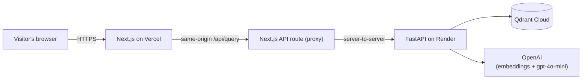

# ask sklearn

[](https://codecov.io/gh/rithikkulkarni/ask-sklearn)

Ask-sklearn is a retrieval-augmented Q&A system over scikit-learn's real GitHub issue tracker. You can ask a question about a bug, an API design debate, or a feature request, and get a cited answer pulled from the actual issue history. If your question seems to be unanswered, Ask-sklearn will let you know.

**[Try the live demo](https://frontend-vert-xi-32.vercel.app)**

## What is ask sklearn?

`scikit-learn`'s issue tracker holds over a decade of engineering discussion in the form of bug reports with stack traces, API design arguments between maintainers, performance tradeoffs, feature requests that got rejected, and oftentimes the why behind it all. That history is mostly unsearchable beyond GitHub's own keyword search.

This project indexes 12,236 of those issues (27,114 chunked pieces) into a vector store, retrieves the ones relevant to a natural-language question, and generates an answer grounded in (and citing) the real discussion. If nothing in the tracker supports an answer, it says so instead of guessing.

## Architecture (how it works)



The browser never talks to the backend directly. It only calls a same-origin Next.js API route, which forwards the request server-side to the FastAPI backend. This keeps the backend URL, and any future auth, out of what a visitor's devtools can see.

Each question runs through:

1. **Retrieval:** The question is embedded and matched against the indexed issue chunks in Qdrant Cloud, either as pure vector similarity (baseline) or narrowed by component/version filters extracted from the question (hybrid).
2. **Confidence gate:** If the best match doesn't surpass the similarity requirement, the system routes to rejection before ever calling the LLM rather than generating from weak context.
3. **Generation:** `gpt-4o-mini` answers strictly from the retrieved chunks, citing the issue numbers that support each claim. Citations are validated against what was actually retrieved, so the model can't cite an issue it wasn't shown.

## For curious developers!

- **Baseline vs. hybrid retrieval** Both modes exist behind the same code path so they can be A/B'd on the same question set rather than argued about.
- **An eval harness with an independent judge?** A hand-written set of 35 real questions (each with a target issue and a short fact rubric) is scored for retrieval precision/recall, groundedness, and answer correctness. The judge is Gemini, which is deliberately a different model from the `gpt-4o-mini` generator so we can avoid having a model grade its own homework.
- **The confidence threshold is tuned from data!** Retrieval scores across the eval set were checked against ground truth to make sure confident answers are actually correct, rather than defaulting to some arbitrary number.
- **Refusal is a first-class outcome.** Both a pre-LLM score gate and a prompt-level instruction allow us to reject answering for lack of basis. The eval harness includes out-of-domain questions specifically to check that this never regressed.
- **Untrusted content is treated as data, not instructions.** Retrieved issue text is real, public GitHub content. Prompts explicitly wrap it and instruct the model not to follow directions that appear inside it.

## Tech stack

| Layer | Choice |
|---|---|
| Frontend | Next.js (App Router, TypeScript), Tailwind CSS v4, deployed on Vercel free tier |
| Backend API | FastAPI, deployed on Render (render.com free tier) |
| Vector store | Qdrant Cloud (free tier) |
| Embeddings & generation | OpenAI (`text-embedding-3-small`, `gpt-4o-mini`) |
| Eval judge | Google Gemini (`gemini-3.5-flash-lite`) |
| Rate limiting | `slowapi`, per-IP, in-memory |
| Testing | `pytest` (backend), TypeScript strict mode + ESLint (frontend) |

## Running it locally

**Backend:** needs a local Qdrant, plus `OPENAI_API_KEY` and `GEMINI_API_KEY` in `.env` (see `.env.example`):

```bash
docker run -p 6333:6333 qdrant/qdrant
pip install -r requirements.txt
python -m src.embedding.embed_and_index   # embed and index the corpus
uvicorn src.api.main:app --reload
```

**Frontend:** needs `BACKEND_URL` in `frontend/.env.local` (see `frontend/.env.local.example`), pointed at your local backend:

```bash
cd frontend
npm install
npm run dev
```

**Evaluation harness:** Scores retrieval and generation quality against the 35-question test set:

```bash
# fast iteration: a hand-picked 6-question subset
python -m src.eval.run_eval --smoke

# full validation: all 35 questions, baseline vs. hybrid
python -m src.eval.run_eval --full
```

Results (per-question transcripts + aggregate metrics) are written to
`data/eval/runs/`.

## Testing

106 unit tests span coverage for the ingestion, chunking, embedding, retrieval, generation, eval, and API layers, run thru `pytest` with coverage tracked in Codecov (badge at README top).

```bash
pytest
ruff check .
black --check .
```
